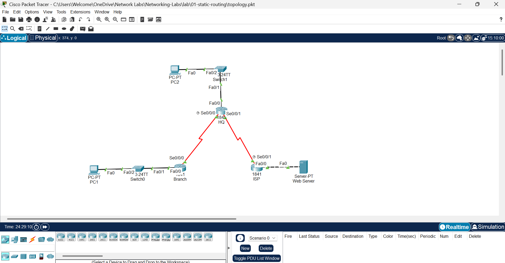
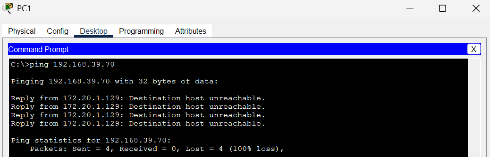
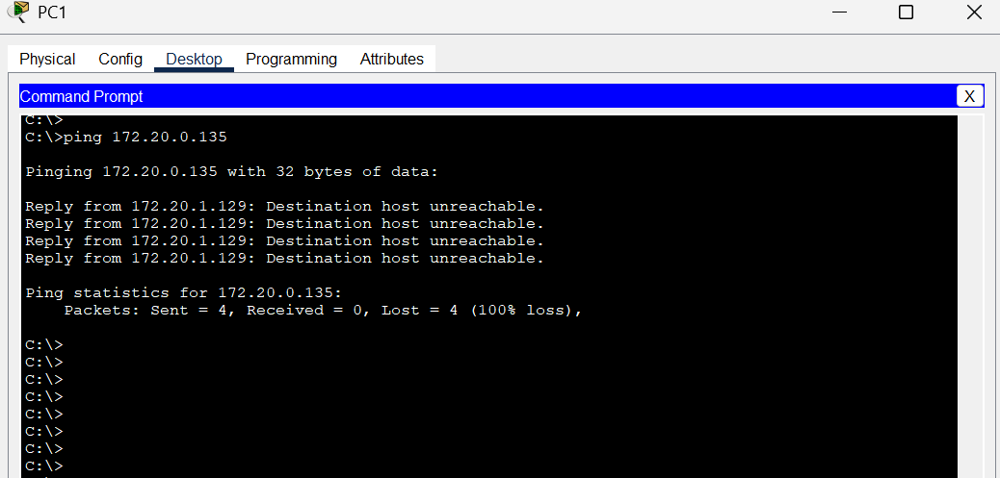
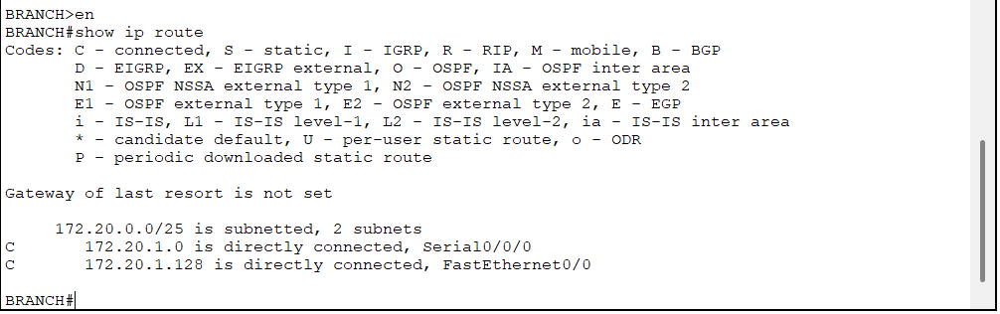
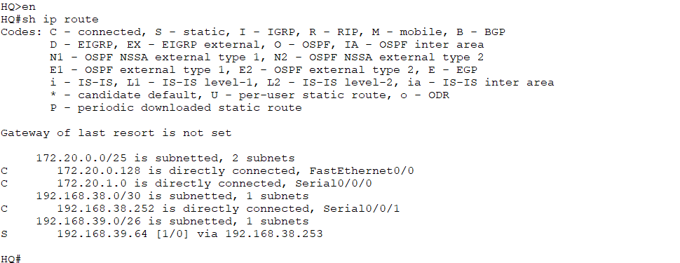
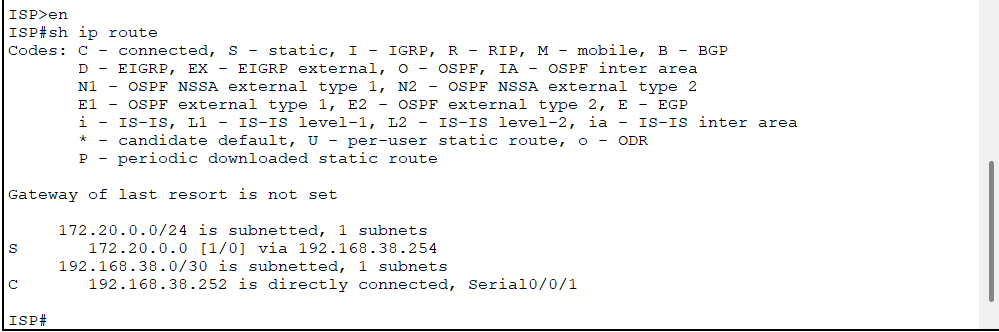

# 🧩 Troubleshooting Report — Static Routing Lab 2.8.3

## 🧠 Problem Summary
Initial configurations on BRANCH, HQ, and ISP routers contained **static routing and interface errors** that prevented end-to-end communication between PC1, PC2, and the Web Server.  
Ping tests failed between LANs, and some interfaces were down or had incorrect route entries.


---

## 🧪 Before Fix (Symptoms)

| Device | Issue | Command Used | Output / Observation |
|:--------|:-------|:--------------|:----------------------|
| BRANCH | Default route pointed to wrong next-hop | `show running-config` | `ip route 0.0.0.0 0.0.0.0 172.20.0.129` (should be HQ's Serial0/0/0 IP 172.20.1.2) |
| HQ | Missing static route to Branch LAN (172.20.1.0/25) | `show ip route` | No route to 172.20.1.0 network |
| HQ | Interface Serial0/0/0 active but static route misconfigured | `show ip interface brief` | Interface up, but connectivity failed |
| ISP | Static route points to wrong subnet mask | `show running-config` | `ip route 172.20.0.0 255.255.255.0 192.168.38.254` (mask mismatch with HQ link) |
| PC1 / PC2 | Could not ping Web Server | `ping 192.168.39.70` | Request timed out |
| Web Server | Could not reach internal LANs | `ping 172.20.0.135` | Request timed out |

**Screenshot / Evidence:**  
- Failed pings from PC1 → Web Server
  
- Failed pings from PC1 → PC2

- Missing static routes  



---

## 🛠️ Fix Applied

### BRANCH Router
```bash
conf t
no ip route 0.0.0.0 0.0.0.0 172.20.0.129
ip route 0.0.0.0 0.0.0.0 172.20.1.2
end
wr
