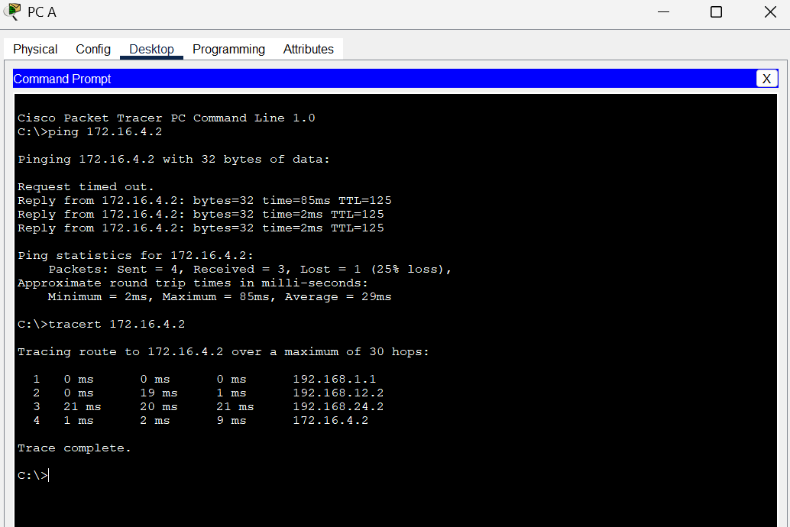

# 🧭 OSPF Single Area Configuration Lab

## 🧪 Objective
The purpose of this lab is to configure **Open Shortest Path First (OSPF)** routing protocol in a single area (Area 0) across four routers — R1, R2, R3, and R4 — to enable dynamic routing and full network connectivity between three local networks (LANs).

---

## 🧰 Devices & Network Summary

| Device | Interface | IP Address     | Subnet Mask       | Default Gateway |
|:-------|:-----------|:---------------|:------------------|:----------------|
| PC A   | NIC        | 192.168.1.2    | 255.255.255.240   | 192.168.1.1     |
| PC B   | NIC        | 10.10.30.2     | 255.255.255.0     | 10.10.30.1      |
| PC C   | NIC        | 172.16.4.2     | 255.255.255.224   | 172.16.4.1      |
| R1     | Fa1/0      | 192.168.1.1    | 255.255.255.240   | —               |
|        | S0/0       | 192.168.12.1   | 255.255.255.252   | —               |
|        | S0/1       | 192.168.13.5   | 255.255.255.252   | —               |
| R2     | S0/0       | 192.168.12.2   | 255.255.255.252   | —               |
|        | S0/1       | 192.168.24.1   | 255.255.255.252   | —               |
| R3     | Fa1/0      | 10.10.30.1     | 255.255.255.0     | —               |
|        | S0/0       | 192.168.13.6   | 255.255.255.252   | —               |
|        | S0/1       | 192.168.34.5   | 255.255.255.252   | —               |
| R4     | Fa1/0      | 172.16.4.1     | 255.255.255.224   | —               |
|        | S0/0       | 192.168.24.2   | 255.255.255.252   | —               |
|        | S0/1       | 192.168.34.6   | 255.255.255.252   | —               |

---

## 🌐 Topology Overview

All routers are in **OSPF Area 0**, interconnected through serial links:


### LAN Networks
- R1 → PC A → 192.168.1.0/28  
- R3 → PC B → 10.10.30.0/24  
- R4 → PC C → 172.16.4.0/27  


---

## ⚙️ Configuration Steps

### 1. **Assign IP Addresses**
Configure all router interfaces according to the table above using:

R1
```bash
en
conf t
hos R1
no ip domain-lookup
int f0/1
ip add 192.168.1.1 255.255.255.240
no sh
int s0/0/0
ip add 192.168.12.1 255.255.255.252
clock rate 64000
no sh
int s0/0/1
ip add 192.168.13.5 255.255.255.252
clock rate 64000
no sh
exit
```

R2
``` bash
en
conf t
hos R2
no ip domain-lookup
int s0/0/0
ip add 192.168.12.2 255.255.255.252
clock rate 64000
no sh
int s0/0/1
ip add 192.168.24.1 255.255.255.252
clock rate 64000
no sh
exit
```

R3
``` bash
en
conf t
hos R3
no ip domain-lookup
int f0/1
ip add 10.10.30.1 255.255.255.0
no sh
int s0/0/0
ip add 192.168.13.6 255.255.255.252
clock rate 64000
no sh
int s0/0/1
ip add 192.168.34.5 255.255.255.252
clock rate 64000
no sh
exit

```

R4

``` bash
en
conf t
hos R4
no ip domain-lookup
int f0/1
ip add 172.16.4.1 255.255.255.224
no sh
int s0/0/0
ip add 192.168.24.2 255.255.255.252
clock rate 64000
no sh
int s0/0/1
ip add 192.168.34.6 255.255.255.252
clock rate 64000
no sh
exit

```


### 1. **Configure OSPF on All Routers**
Configured OSPF in a single area 0 across multiple routers.

R1
```bash
router ospf 1
 router-id 1.1.1.1
 network 192.168.1.0 0.0.0.15 area 0
 network 192.168.12.0 0.0.0.3 area 0
 network 192.168.13.4 0.0.0.3 area 0

```
R2
```bash
router ospf 1
 router-id 2.2.2.2
 network 192.168.12.0 0.0.0.3 area 0
 network 192.168.24.0 0.0.0.3 area 0

```
R3
```bash
router ospf 1
 router-id 3.3.3.3
 network 10.10.30.0 0.0.0.255 area 0
 network 192.168.13.4 0.0.0.3 area 0
 network 192.168.34.4 0.0.0.3 area 0
```
R4
```bash
router ospf 1
 router-id 4.4.4.4
 network 172.16.4.0 0.0.0.31 area 0
 network 192.168.24.0 0.0.0.3 area 0
 network 192.168.34.4 0.0.0.3 area 0
```
### Verify OSPF Adjacencies
Use the command "show ip ospf neighbor" on each router:

#### R1


#### R2


#### R3


#### R4


### Connectivity Test
From PC A, ping to verify end-to-end reachability:

#### To PC C



#### To PC B


---

## 🧾 Results


| Test                     | Expected Output               | Result    |
| ------------------------ | ----------------------------- | --------- |
| `show ip ospf neighbor`  | Full adjacency on all routers | ✅ Success |
| `show ip route ospf`     | All networks visible          | ✅ Success |
| `ping` from PC A to PC B | Reply received                | ✅ Success |
| `ping` from PC A to PC C | Reply received                | ✅ Success |


---


## 🧠 Key Learning Outcomes

* Configured OSPF in a single area 0 across multiple routers.
* Verified OSPF neighbor relationships and route propagation.
* Achieved full connectivity between multiple LANs dynamically.
* Understood wildcard masks, router IDs, and OSPF area concepts.
  

---


## 🧩 Author

- **Name:** Imesh Rathnayake  
- **Program:** Computer Networks Undergraduate — NSBM Green University  
- **Lab Title:** *OSPF Configuration — Lab 1*  
- **Date:** *October 2025*

